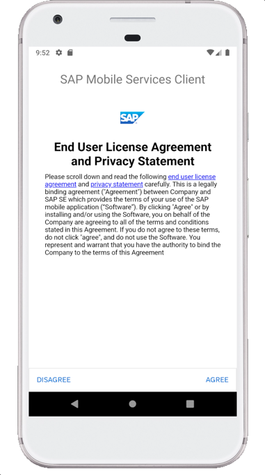
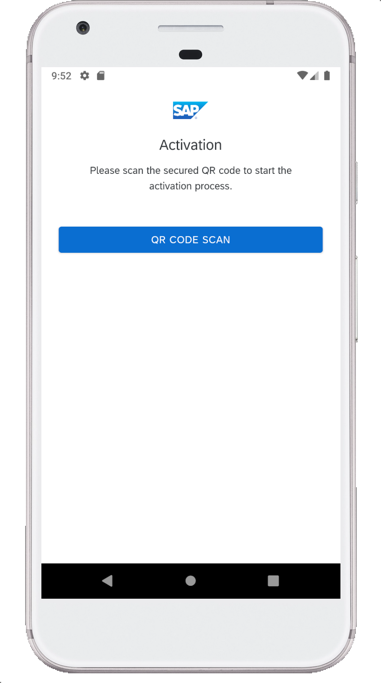
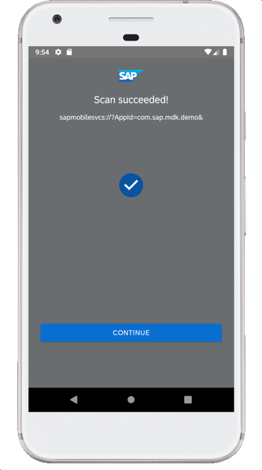
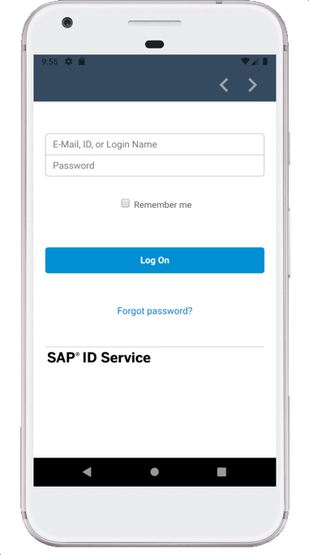
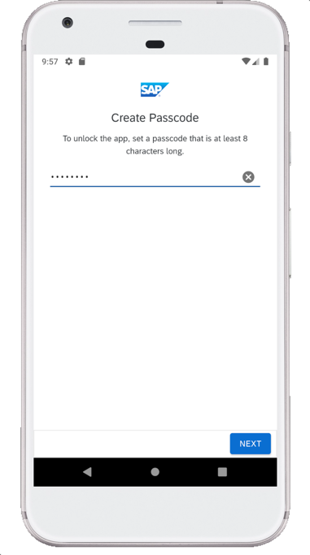
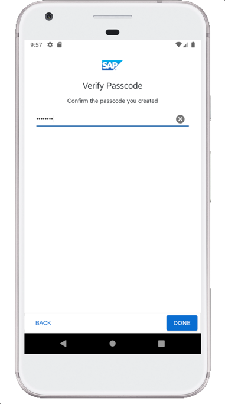
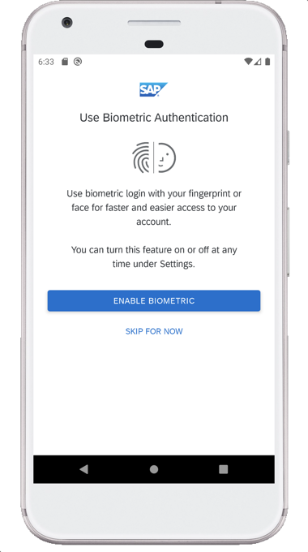
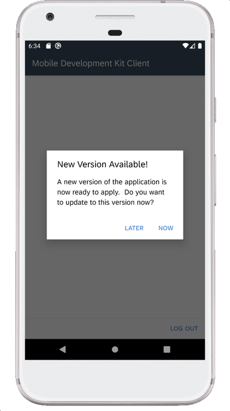

1. Launch **`Mobile Svcs`** app on your Android device. Tap **AGREE** on `End User License Agreement`.

    

2. Tap **GET STARTED** to connect MDK client to SAP Cloud Platform.

    

3. Tap **QR CODE SCAN** to start the device camera for scanning the onboarding QR code.

    

4. Once scan is succeeded, tap **CONTINUE**.

    

5. Enter your credentials to login to SAP Cloud Platform and tap **Log On** to authenticate.

    

6. Choose a passcode with at least 8 characters for unlocking the app and tap **NEXT**.

    

7. Confirm the passcode and tap **DONE**.

    

    Optionally, you can enable Biometric authentication to get faster access to the app data.

    

8. Tap **OK**.

    

    The MDK client receives deployed metadata definitions as a bundle.
