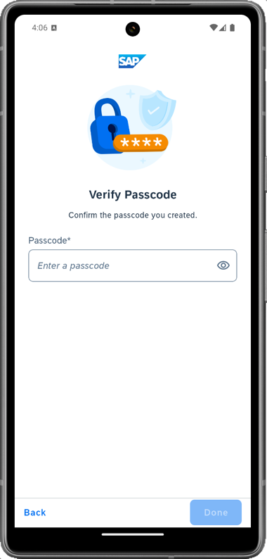
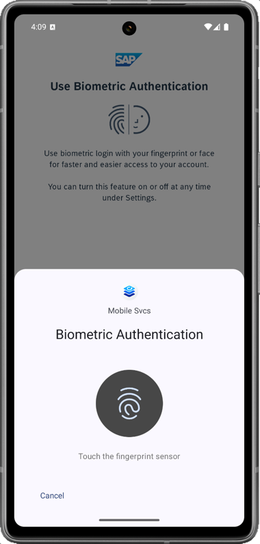
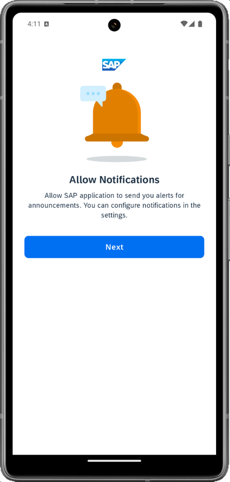
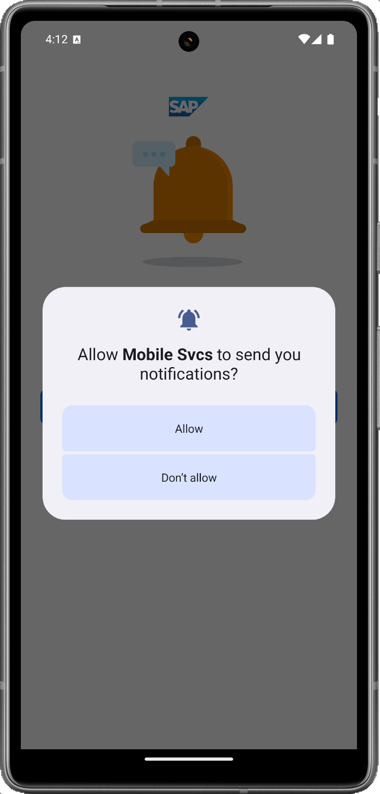

>Depending on your device's appearance, UI in the MDK client changes accordingly.

1. Launch **`Mobile Svcs`** app on your Android device. 
Tap **Agree** on `End User License Agreement and Privacy Statement`.

    

2. Tap **Scan** to start the device camera for scanning the onboarding QR code. Please note, if you already have the MDK client on-boarded, tap *Get Started* or *Scan new QR code* to continue.
    
    

3. Allow the app to access the camera on your device to scan the onboarding QR code.

    

4. Once scan is succeeded, tap **Continue**.

    

5. Enter your E-Mail, ID or Login Name to log into BTP. 

    

6. Enter your Universal ID password to login to SAP Business Technology Platform (BTP).

    

7. Create a passcode that is at least 8 characters long to unlock the app, and then tap **Next**.

        

8. Confirm the passcode and tap **Done**.

    

9. You have the option to enable Biometric Authentication for faster access to app data. Provide your biometric information.

    

9. Tap **Next**. If you want your MDK client to send you notifications, tap **Allow**, otherwise, tap **Don't allow**. 

    
    

10. Tap on **Now** to accept the deployed metadata definitions.

    