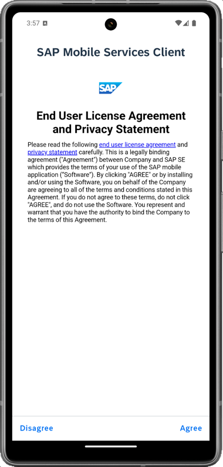
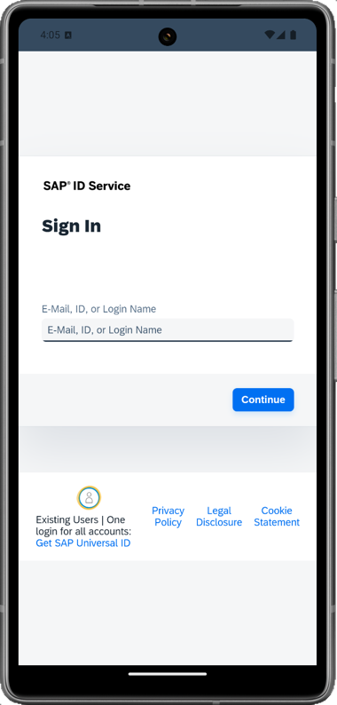

>Depending on your device's appearance, UI in the MDK client changes accordingly.
1. Launch **`Mobile Svcs`** app on your Android device. 
Tap **AGREE** on `End User License Agreement`.

    
    
2. Tap **SCAN** to start the device camera for scanning the onboarding QR code.
    

 > If you already have the MDK client on-boarded, tap *GET STARTED* and *SCAN NEW QR CODE* to continue.

3. Once scan is succeeded, tap **CONTINUE**.

    

4. Enter your credentails to login to SAP Business Technology Platform (BTP) and tap **Log On** to authenticate.

    

5. Choose a passcode with at least 8 characters for unlocking the app and tap **NEXT**.

        

6. Confirm the passcode and tap **DONE**.

    

    Optionally, you can enable Biometric authentication to get faster access to the app data.

    

8. Tap **NOW** to accept the deployed metadata definitions.

    