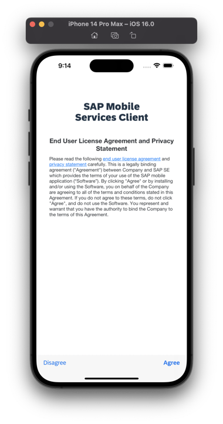
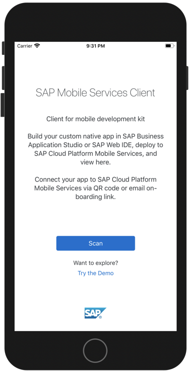
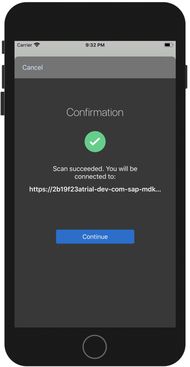
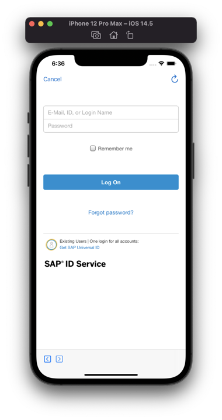
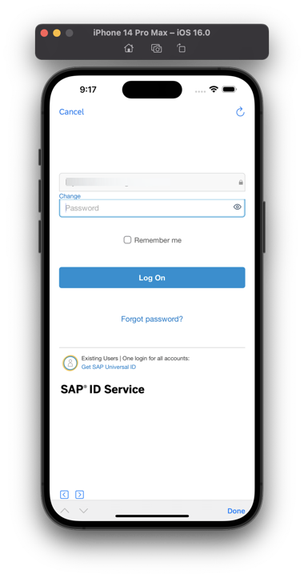
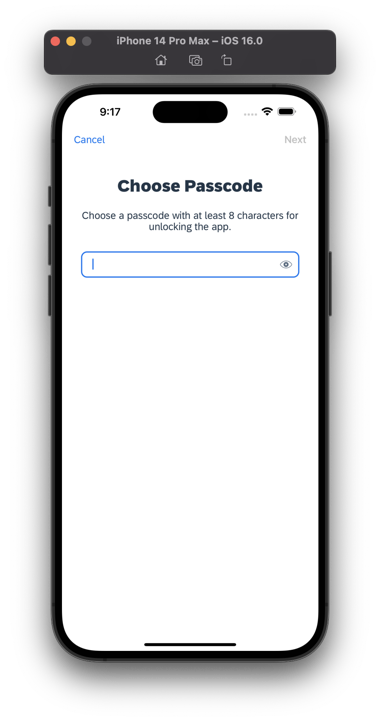
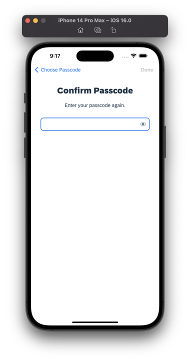
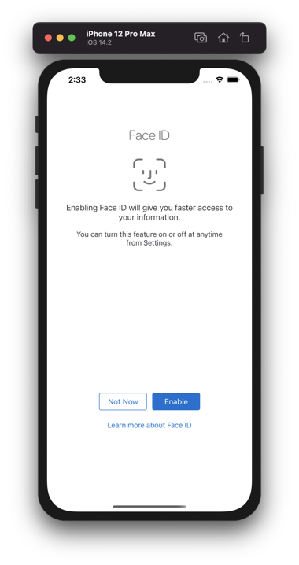
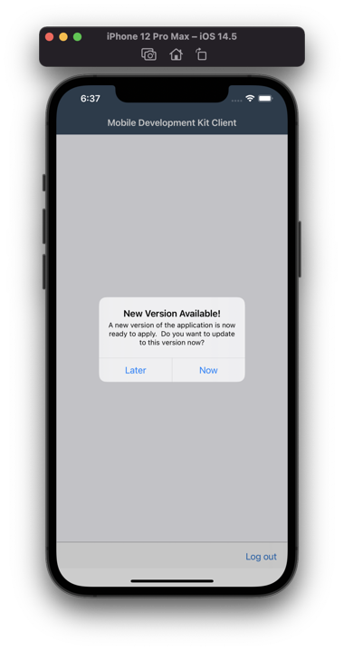

>Depending on your device's appearance, UI in the MDK client changes accordingly.
1. Launch **`Mobile Svcs`** app on your iOS device. Tap **Agree** on `End User License Agreement`.

    

2. Tap **Scan** to start the device camera for scanning the onboarding QR code.

    

> If you already have the MDK client on-boarded, click *Start* and *Scan new QR code* to continue.

3. Once scan is succeeded, tap **Continue**.

    

4. Enter your credentials to login to SAP Business Technology Platform (BTP).

    
    

5. Choose a passcode with at least 8 characters for unlocking the app and tap **Next**.

    

6. Confirm the passcode and tap **Done**.

    

7. Optionally, you can enable Biometric authentication to get faster access to the app data, tap **Enable**.

    

8. Tap **Now** to accept the deployed metadata definitions.

    