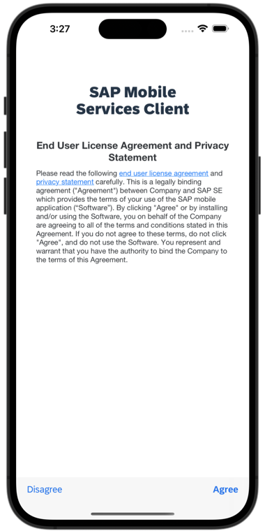
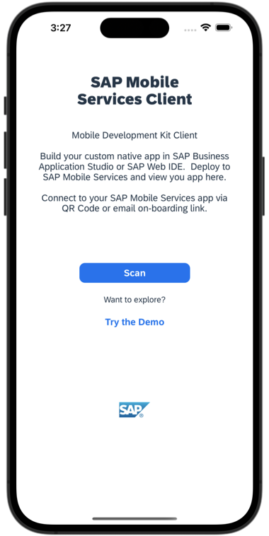
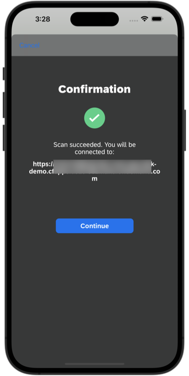
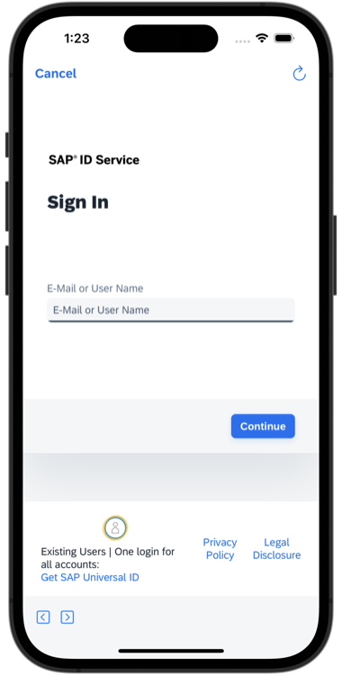
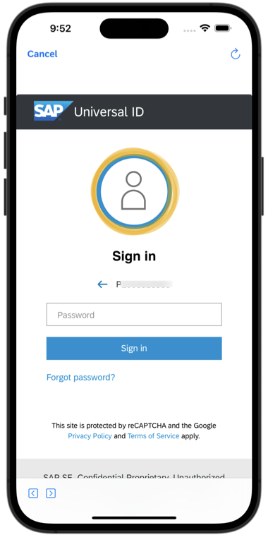
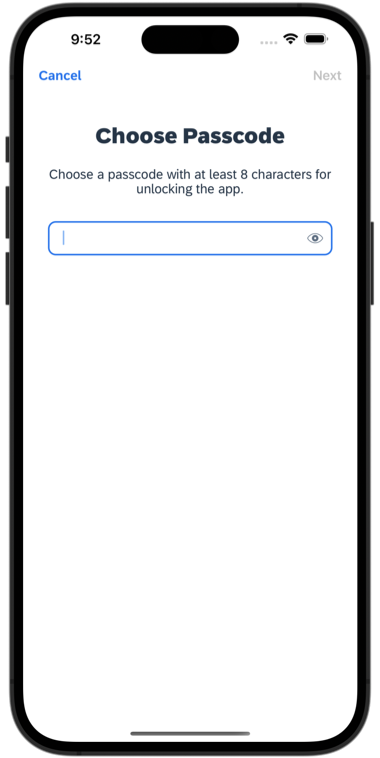
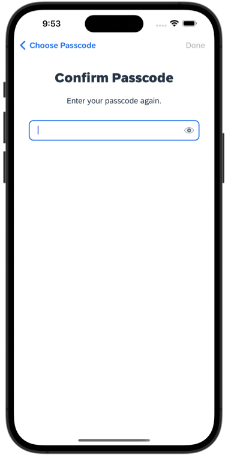
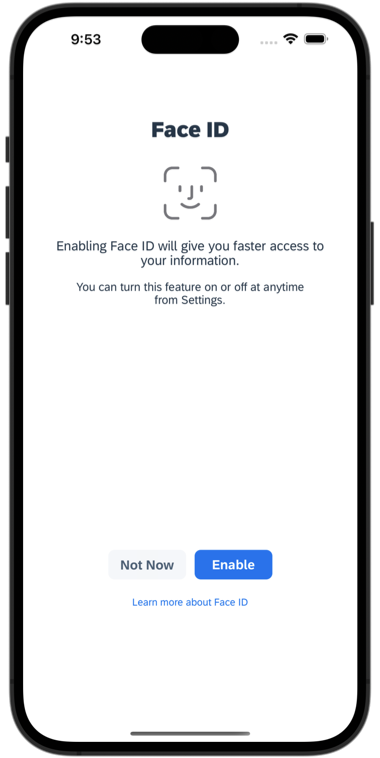
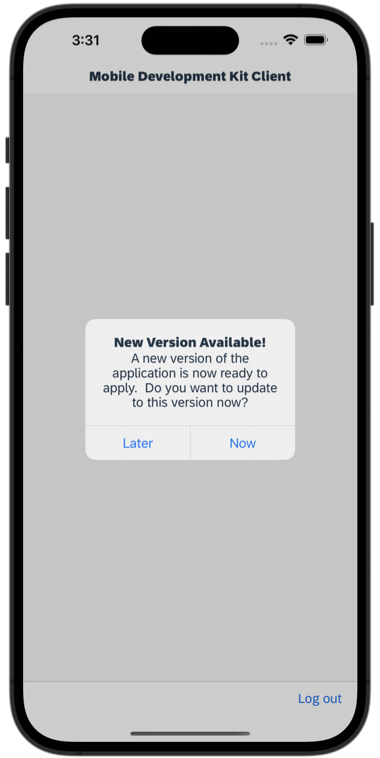

>Depending on your device's appearance, UI in the MDK client changes accordingly.

1. Launch **`Mobile Svcs`** app on your iOS device. Tap **Agree** on `End User License Agreement and Privacy Statement`.

    

2. Tap **Scan** to start the device camera for scanning the onboarding QR code. Please note, if you already have the MDK client on-boarded, tap *Get Started* and *Scan new QR code* to continue.

    

3. Once scan is succeeded, tap **Continue**.

    

4. Enter your E-Mail, ID or Login Name to log into BTP. 

    

5. Enter your Universal ID password to login to SAP Business Technology Platform (BTP).

    

6. Create a passcode that is at least 8 characters long to unlock the app, and then tap **Next**.

    

7. Confirm the passcode and tap **Done**.

    

8.  You have the option to enable Biometric Authentication for faster access to app data. Tap **Enable** if you wish to use this feature. Please note that if your client is multi-user enabled, you won't see the screen below.

    

9. Tap on **Now** to accept the deployed metadata definitions.

    